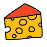

<p align="center">
  <a href="" rel="noopener">
 </a>
</p>

<h3 align="center">Meals App</h3>

<div align="center">

[]()
[](/LICENSE)

</div>

---

<p align="center"> Few lines describing your project.
    <br> 
</p>

## 📝 Table of Contents

- [About](#about)
- [Getting Started](#getting_started)
- [Deployment](#deployment)
- [Usage](#usage)
- [Built Using](#built_using)
- [Authors](#authors)

## 🧐 About <a name = "about"></a>

This is a Meals App Website made using The MealsDB api.

## 🏁 Getting Started <a name = "getting_started"></a>

These instructions will get you a copy of the project up and running on your local machine for development and testing purposes. See [deployment](#deployment) for notes on how to deploy the project on a live system.

### Prerequisites

What things you need to install the software and how to install them.

```
> Bootstrap
> js
> Font Awesome
> TheMealsDB API
```

## 🎈 Usage <a name="usage"></a>

Go to index.html

## 🚀 Deployment <a name = "deployment"></a>

Go To https://0verflowme.github.io/meals-app/

## ✍️ Authors <a name = "authors"></a>

- [@0verflowme](https://github.com/0verflowme) - Idea & Initial work
